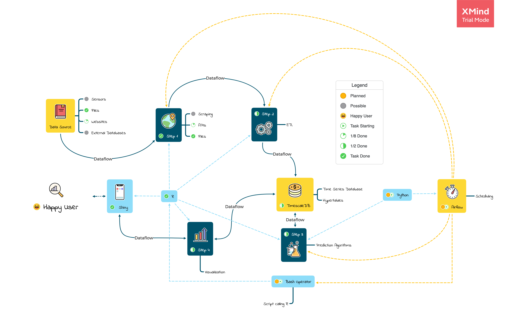

# Time Series Prediction Infrastructure

## Table of contents
* [Introduction](#introduction)
* [Background](#background)
* [Technologies](#technologies)
* [Dataflows](#dataflows)
* [Local Setup](#local-setup)
* [Cloud Setup](#cloud-setup)
* [Status](#status)
* [Inspiration](#inspiration)
* [Contact](#contact)

## Introduction

The project provides a concept for a scalable infrastructure approach to modern analytics for time series data, either locally or on the cloud. The infrastructure consists of five core technologies, which are all open source. The strength lies within the unique characteristics of the time-series database 'TimescaleDB', the web-application framework 'Shiny', and the workflow management system 'Airflow'. All three tied together by the scripting languages 'R' & 'Python', provide everything to power time-series predictive analytics of small departments to a whole company. The concept can adapt and scale along with the needs of small and big data.

For a more detailed tutorial of how this infrastructure works in practice visit my [Website](http://schroederjan.com/). `COMING SOON`

## Background
When working with time-series data I wanted to work as many transformations as possible to find the optimal input into prediction algorithms. Either daily, weekly, monthly or even bigger aggregates could deliver THE insight needed. To achieve this, normally I was writing on transformation scripts that would, after a while of calculation, spit out various csv files in a folder, which I then had to access in my analytics framework of choice for further crunching. 

When I found 'TimescaleDB' I saw it as the chance to speedup time-series analytics and the perfect backend for shiny (no pun intended) web-applications. With its built-in aggregation functions for time series, on-demand transformation is possible. No more pre-transforming data needed.

Adding the workflow management engine 'Aiflow' we can run scheduled predictions, ETL commands, or even manage whole cloud infrastructures in a monitored and structured way.

Time-series analytics was never so easy!
Below you can have a look at how this project is set up.
Each of the core technologies has a sub-readme linked to it for a deep dive. `COMING SOON`

## Technologies

### Scripting Languages
* [`R`](https://www.r-project.org/) as scripting language for data preparation and prediction algorithms based on `R`. Also used for the user interface, a `Shiny` application.
* [`Python`](https://www.python.org/) as scripting language for `Airflow` and prediction algorithms based on `Python`.

### Core Technologies
* [`Shiny Server`]() as `R` engine that will run the scripts and the user interface, a `Shiny` application.
* [`TimescaleDB`]() as time series database build on top of Postgres that will hold all data. `TimescaleDB`
* [`Airflow`]() as scheduling work-flow manager to coordinate the whole infrastructure. `Airflow`

## Dataflows
* [Step 1] Connect to different data sources using `R`.
* [Step 2] Prepare and clean the data, then store it to the time series database using `R`.
* [Step 3] Run Prediction and other algorithms on the data stored in the `TimescaleDB` using `R` and `Python`.
* [Step 4] Visualize the data and results for insight using `R` in `Shiny`.

## Local Setup

Here I will show you how to set up this infrastructure manually. `COMING SOON`

## Cloud Setup

Here I will show you how to set up this infrastructure automatically on the cloud. `COMING SOON`

## Status
The project is _in progress_ and will be expanded with new features regularly.
My goal is it to build a state of the art "Time Series Prediction Infrastructure" that others can customize or expand at will to their needs.

### To-do list:

* Local Setup
* Cloud Setup
* Sub-readme: Shiny Server (+ App)
* Sub-readme: TimescaleDB
* Sub-readme: Airflow
* Use-case blog entry on my website

## Inspiration

* [Business Science University](https://university.business-science.io/) for `Shiny` and `R` for Data Science
* [Rob J Hyndman](https://robjhyndman.com/publications/) for statistics with `R` 
* [Timescale](https://www.timescale.com/) for `TimescaleDB`
* [Apache Airflow](https://airflow.apache.org/) for `Airflow`
* [Xmind](https://www.xmind.net/xmind2020/) for the tool of my illustrations.

## Contact
Created by [Jan Schroeder](https://www.schroederjan.com/) - feel free to contact me!

