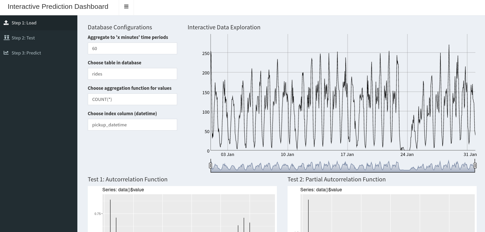
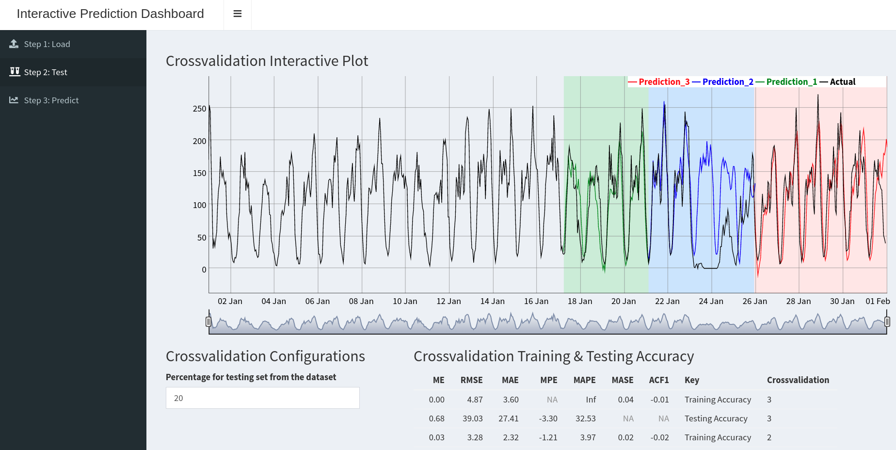
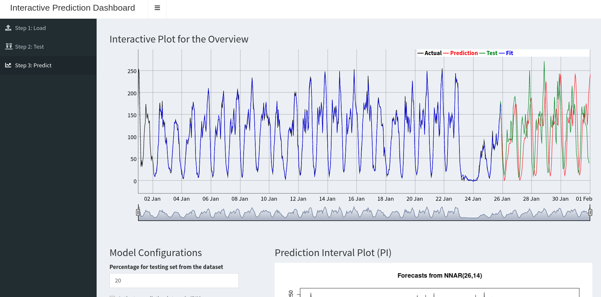

# Time Series Prediction Infrastructure - Shiny
> This is part 2 of the deep dive into the project

## Table of contents
* [Introduction](#introduction)
* [Dependencies](#dependencies)
* [Walkthrough](#walkthrough)
* [Contact](#contact)

## Introduction
This part is an adaptation of [another project](https://github.com/AionosChina/interactive-shiny-analytics) of mine, maintaining an interactive shiny analytics template for time series predictions.

After having our data ready in our brand new time-series database, we need a way to interact with it. Naturally, we could just send SQL queries, but this is leaving a lot of potential left out. We are connecting a `Shiny` web-application to the database.

### Objectives

1. We want to get `Shiny` (locally) or a `Shiny Server` (in the cloud) running.
2. We want to install all necessary packages needed for the application.
3. We want to move our application to the server (in the cloud).
4. We want to start playing around with our data.
5. Done! We are ready to go to the next (optional) part of the project -> [`Airflow`](https://github.com/AionosChina/Time-Series-Prediction-Infrastructure/tree/main/airflow)

### Folder Structure

```bash
├── app.R
├── man
│   ├── featured_1.png
│   ├── featured_2.png
│   └── featured_3.png
├── modules
│   ├── config.yml
│   ├── crossvalidationModule.R
│   ├── functions.R
│   ├── install_packages.R
│   ├── loadModule.R
│   ├── packages.R
│   └── predictModule.R
└── README.md
```

### Scripts
#### Application
* [`app.R`](https://github.com/AionosChina/Time-Series-Prediction-Infrastructure/blob/main/shiny/app.R) this is the actual application calling several modules.

#### Modules
The modules are the heart of the application, they can be seen as puzzle pieces that can be run as standalone app or put together in the app.R file.

* [`loadModule.R`](https://github.com/AionosChina/Time-Series-Prediction-Infrastructure/blob/main/shiny/modules/loadModule.R) for loading data from the database.
* [`crossvalidationModule.R`](https://github.com/AionosChina/Time-Series-Prediction-Infrastructure/blob/main/shiny/modules/crossvalidationModule.R) for applying a crossvalidation test to the data.
* [`predictionModule.R`](https://github.com/AionosChina/Time-Series-Prediction-Infrastructure/blob/main/shiny/modules/predictionModule.R) for running prediction models on the data.

### Other Scripts
* [`functions.R`](https://github.com/AionosChina/Time-Series-Prediction-Infrastructure/blob/main/shiny/modules/functions.R) holding all functions that need to be loaded by the app
* [`packages.R`](https://github.com/AionosChina/Time-Series-Prediction-Infrastructure/blob/main/shiny/modules/packages.R) holding all packages that need to be loaded by the app
* [`install_packages.R`](https://github.com/AionosChina/Time-Series-Prediction-Infrastructure/blob/main/shiny/modules/install_packages.R) script for installing all package dependencies in R

## Dependencies
For the project to work, you need to have `R` installed, `Shiny Server` installed and running and all required R packages installed.

### [R](https://www.r-project.org/)
All versions of R (>= 3.6.3) should be fine. If you need more help with R and RStudio, you can find detailed instructions [here](https://rstudio.com/products/rstudio/download/#download).

### [Shiny](http://shiny.rstudio.com/tutorial/)
If you have never programmed a Shiny app before, I recommend you to check out the [Shiny Tutorial](http://shiny.rstudio.com/tutorial/). It explains the framework in-depth, walks you through building a simple application, and includes extensive annotated examples.

NOTE: I am using the new `Shiny` (>1.5.0) and apply the `moduleServer` instead of the `callModule` function as per documentation.

### R Packages
In my experience, there should be no big problem with different versions of R packages in this project. Just install the packages manually as usual or run the file [install_packages.R](https://github.com/AionosChina/Time-Series-Prediction-Infrastructure/tree/main/shiny/modules/install_packages.R) like this:
```bash
#cd to file location and run
Rscript install_packages.R
```
When you are working on Linux you will probably need to install some additional OS packages. PLease take the information from the error message when the R package installation fails.

### Configuration Files
For security and adjustability reasons I saved the database password in a yaml file called: "config.yml"
The file is not present in this repo but is necessary for it to work. 
Please place a file with the name "config.yml" and the following content together with the scripts:
```bash
TIMESCALEDB: 
  PW: <YOUR PASSWORD>
```

## Walkthrough
### Objective 1 (Get the application server running...)

When running the application locally, for testing, it is best just to install R, RStudio and Shiny on your machine by following this explanation [here](https://github.com/AionosChina/interactive-shiny-analytics#dependencies) and then start the `app.R` file as with any Shiny application.

When running on a server you want to install the `Shiny Server`, which I will showcase [here](https://github.com/AionosChina/Time-Series-Prediction-Infrastructure/tree/main/cloud#setup-shiny).

### Objective 2 (Get the packages installed...)
Please check: [Dependencies](#dependencies)

### Objective 3 (Get the application files on to the server...)
When running locally with RStudio there has nothing to be done. Just run the `app.R` file inside RStudio.
With `Shiny Server` you can check it [here](https://github.com/AionosChina/Time-Series-Prediction-Infrastructure/tree/main/cloud#setup-shiny) as well.

### Objective 4 (Playing around with the data...)
And finally we can use the application. Below we will go only briefly through the modules and what they are supposed to do. For more details check the blog entry. (When ready it should be on my [website](schroederjan.com))

#### loadModule
This module will connect to the `timescaleDB` instance on the local host and log in with your default credentials from the last part (and the password in the config.yml file). After the connection is established we can play around with the aggregation function of the database and see the data visualized immediately. You can see that the aggregation degree of the data will have an impact on the ACF tests below.


#### crossvalidationModule
This module will take the aggregated data from module one and run a crossvalidation function on it, including visualization and accuracy tests.


#### predictionModule
This module will show more details of the prediction algorithm applied and together with the crossvalidation will let us know if a prediction is reasonable or not.


### Objective 5 (Done!)
Let's continue with the next (optional) part of the project -> [`Airflow`](https://github.com/AionosChina/Time-Series-Prediction-Infrastructure/tree/main/airflow)

## Contact
Created by [Jan Schroeder](https://www.schroederjan.com/) - feel free to contact me!

